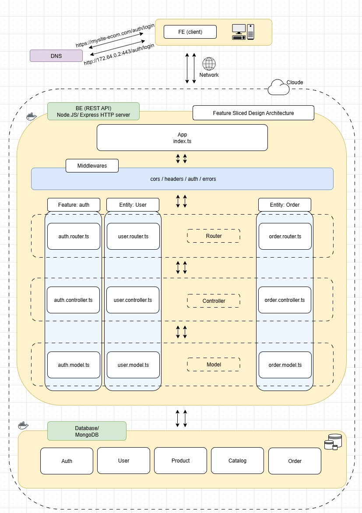
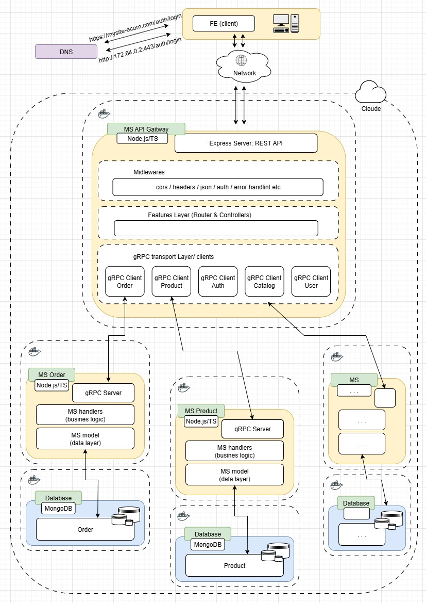
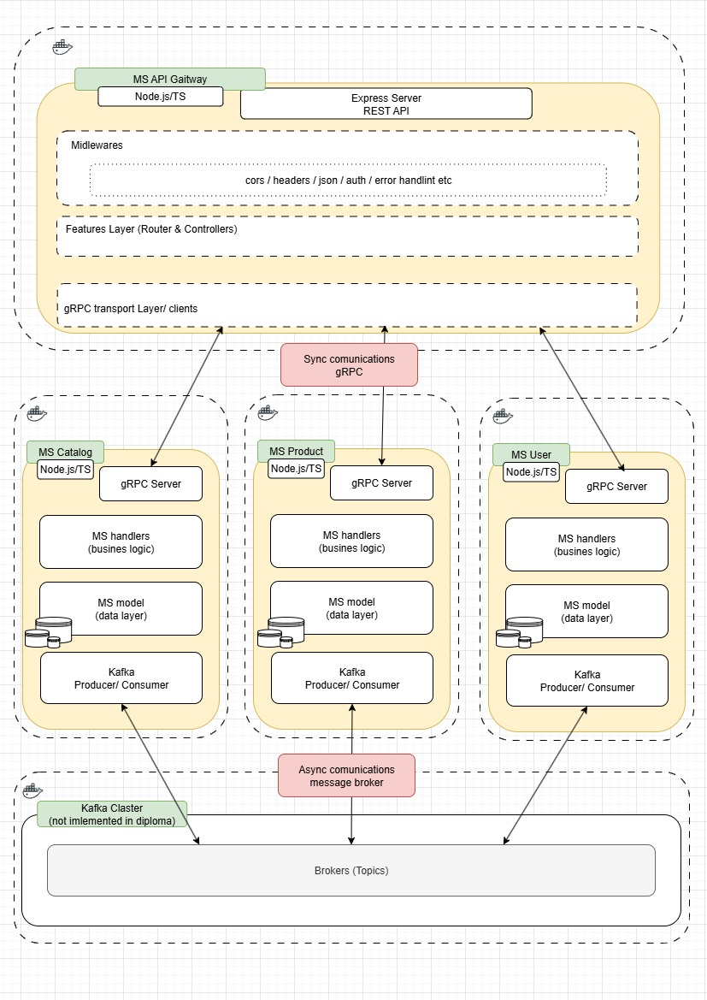
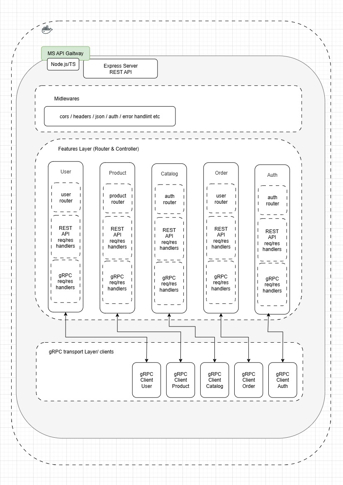
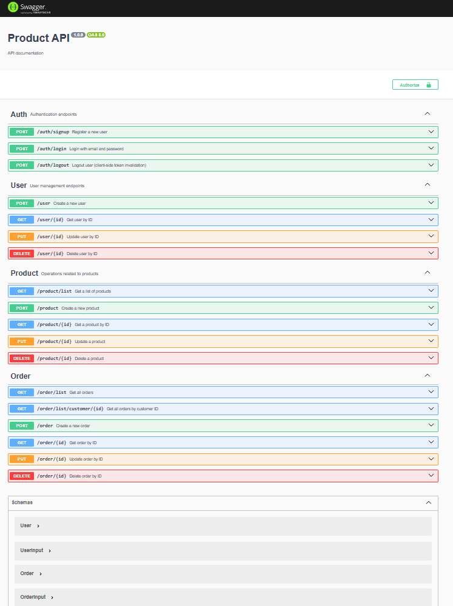

### services:

- gateway: http://localhost:8030
- auth: http://localhost:50054
- catalog: http://localhost:50055
- order: http://localhost:50051
- product: http://localhost:50052
- user: http://localhost:50053

### kafka:

- server: http://localhost:9092
- ui: http://localhost:8085

### db ms:

- authDb: http://localhost:27022
- userDb: http://localhost:27018
- orderDb: http://localhost:27019
- productDb: http://localhost:27021
- catalogDb: http://localhost:27020

### Starting a project

```bash
npm install
docker-compose up -d
npm run seed
```

```bash
./start-services.sh
```

### Connect & checking db

```bash
docker exec -it user_db mongosh -u root -p example --authenticationDatabase admin

show dbs

use user_db

db.users.find().pretty()

db.orders.find({ user: ObjectId('68a7693e2458fe0e31fed0f8') }).pretty()
```

### Monolith layered FSD:



### Microservice architecture:



### Microservice Catalog folder structure:


```
catalog-service/
├── dist/
├── node_modules/
├── scripts/
├── src/
│   ├── app/
│   │   ├── grpc/
│   │   │   └── CatalogServer.ts
│   │   ├── providers/
│   │   │   ├── db.ts
│   │   │   └── logger.ts
│   │   ├── config/
│   │   │   └── index.ts
│   │   ├── grpc/
│   │   │   ├── generated/
│   │   │   │   └── proto/
│   │   │   └── mappers/
│   │   │       └── catalog.mapper.ts
│   │   ├── models/
│   │   │   └── catalog.model.ts
│   │   ├── services/
│   │   │   └── catalog.service.ts
│   │   ├── shared/
│   │   │   ├── constants/
│   │   │   │   └── errorMessages.ts
│   │   │   ├── errors/
│   │   │   │   └── GrpcError.ts
│   │   │   └── libs/
│   │   │       └── validators.ts
│   │   └── catalog-test-client.ts
│   └── index.ts
├── .gitignore
├── .prettierrc
├── docker-compose.yml
├── eslint-config.mjs
├── package-lock.json
├── package.json
├── README.md
├── tsconfig.eslint.json
└── tsconfig.json
```

### Sync and async Microservices interaction:



### API Gateway service design:



### API Gateway service:

```
gateway/
├── docs/
│   ├── auth.yaml
│   ├── catalog.yaml
│   ├── order.yaml
│   ├── product.yaml
│   └── user.yaml
├── features/
│   ├── auth/
│   │   ├── auth.controller.ts
│   │   └── auth.routes.ts
│   ├── catalog/
│   │   ├── catalog.controller.ts
│   │   ├── catalog.routes.ts
│   │   └── catalog.services.ts
│   ├── order/
│   │   ├── order.controller.ts
│   │   └── order.routes.ts
│   ├── product/
│   │   ├── product.controller.ts
│   │   ├── product.routes.ts
│   │   └── product.services.ts
│   └── user/
│       ├── user.controller.ts
│       ├── user.routes.ts
│       └── user.schema.ts
│       └── user.services.ts
├── src/
│   ├── app/
│   │   ├── providers/
│   │   │   └── expressApp.ts
│   │   └── config/
│   │       └── index.ts
│   ├── shared/
│   │   ├── constants/
│   │   ├── errors/
│   │   ├── libs/
│   │   └── middlewares/
│   │       ├── auth.middleware.ts
│   │       ├── error.middleware.ts
│   │       └── validate.middleware.ts
│   └── index.ts
├── .gitignore
├── docker-compose.yml
├── Dockerfile
├── eslint-config.mjs
├── package-lock.json
├── package.json
├── README.md
├── tsconfig.eslint.json
└── tsconfig.json
```

### Project folder structure:

```
ms/
├── docs/
├── libs/
├── node_modules/
├── scripts/
├── services/
│   ├── auth-service/
│   ├── catalog-service/
│   ├── gateway/
│   ├── order-service/
│   ├── product-service/
│   └── user-service/
├── .gitignore
├── docker-compose.yml
├── package-lock.json
├── package.json
├── README.md
└── start-services.sh
└── tsconfig.json
```

### API doc`s. Swagger:



```
REST Endpoints:
├── /auth/* → Auth Service
├── /catalog/* → Catalog Service
├── /order/* → Order Service
├── /product/* → Product Service
└── /user/* → User Service
```

```
gateway/
├── features/          # Feature-based organization
│   ├── auth/          # Auth proxy endpoints
│   ├── catalog/       # Catalog proxy endpoints
│   ├── order/         # Order proxy endpoints
│   ├── product/       # Product proxy endpoints
│   └── user/          # User proxy endpoints
├── src/app/           # Express app configuration
├── shared/            # Common utilities and middleware
└── docs/              # OpenAPI/Swagger documentation
```

```
catalog-service/
├── src/app/
│   └── grpc/
│       ├── CatalogServer.ts    # gRPC server setup
│       └── generated/          # Proto-generated code
│           ├── proto/
│           └── mappers/        # Data mapping utilities
├── models/                     # Data models
├── services/                   # Business logic
├── shared/                     # Common utilities
└── catalog-test-client.ts      # Testing client
```

```
Frontend → Gateway (REST) → Catalog Service (gRPC) → MongoDB
```

```
service CatalogService {
  rpc SearchProducts(SearchRequest) returns (ProductListResponse);
  rpc GetProducts(GetProductsRequest) returns (ProductListResponse);
  rpc GetCategories(GetCategoriesRequest) returns (CategoryListResponse);
}
```

```
message ProductResponse {
  string id = 1;           # Unique identifier
  string productId = 2;    # Business product ID
  string name = 3;         # Product name
  string title = 4;        # Display title
  double price = 5;        # Product price
  int32 quantity = 6;      # Available quantity
  string category = 7;     # Product category
  string imageUrl = 8;     # Product image URL
  bool inStock = 9;        # Stock availability
}
```

```
message GetProductsRequest {
  int32 page = 1;          # Pagination page
  int32 limit = 2;         # Results per page
  string category = 3;     # Category filter
  string sort = 4;         # Sorting criteria
}
```

### Grafana`s config

```
{
  "annotations": {
    "list": []
  },
  "panels": [
    {
      "type": "stat",
      "title": "Total gRPC Requests",
      "datasource": "Prometheus",
      "targets": [
        {
          "expr": "sum(grpc_requests_total)",
          "legendFormat": "total",
          "refId": "A"
        }
      ],
      "gridPos": {"x":0,"y":0,"w":12,"h":4}
    },
    {
      "type": "graph",
      "title": "gRPC Requests by Method & Status",
      "datasource": "Prometheus",
      "targets": [
        {
          "expr": "sum by (method, status) (rate(grpc_requests_total[1m]))",
          "legendFormat": "{{method}} - {{status}}",
          "refId": "B"
        }
      ],
      "gridPos": {"x":0,"y":4,"w":12,"h":8},
      "lines": true,
      "linewidth": 2
    },
    {
      "type": "graph",
      "title": "gRPC Request Duration P95",
      "datasource": "Prometheus",
      "targets": [
        {
          "expr": "histogram_quantile(0.95, rate(grpc_request_duration_seconds_bucket[1m]))",
          "legendFormat": "{{method}}",
          "refId": "C"
        }
      ],
      "gridPos": {"x":0,"y":12,"w":12,"h":8},
      "lines": true,
      "linewidth": 2
    }
  ],
  "title": "gRPC Metrics Dashboard",
  "schemaVersion": 36,
  "version": 1,
  "refresh": "5s"
}

```
